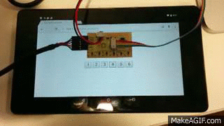

#Serial to SocketIO
This project demonstrates how to implement a thin proxy server in [node.js](http://nodejs.org/) (using [expressjs](http://expressjs.com/)) that relays data to/from the serial port from/to to web clients via [socket.io](http://socket.io).


##Usage
###install prerequisites
```bash
    npm install
```

###start
```bash
    node app.js <serial_port>
```

You can now access the demos at [http://127.0.0.1:3000](http://127.0.0.1:3000).

There are two demos in the project:
####1. Input.
reading temperatures from a board matching Neil Gershenfeld's hello.temp.45 example ([board](http://academy.cba.mit.edu/classes/input_devices/temp/hello.temp.45.png), [code](http://academy.cba.mit.edu/classes/input_devices/temp/hello.temp.45.c)).


####2. Output.
writing to a custom led array board ([board](), [code]()).


