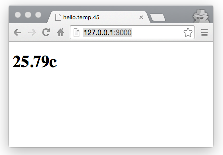

#Serial to SocketIO
This project demonstrates how to implement a thin proxy server in [node.js](http://nodejs.org/) (using [expressjs](http://expressjs.com/)) that reads input from the serial port and forwards it to web clients via [socket.io](http://socket.io).


The specific client used in this demo presents temperature readings from a board matching Neil Gershenfeld's hello.temp.45 example ([board](http://academy.cba.mit.edu/classes/input_devices/temp/hello.temp.45.png), [code](http://academy.cba.mit.edu/classes/input_devices/temp/hello.temp.45.c)).

##Usage
###install prerequisites
```bash
    npm install
```

###start
```bash
    node app.js <serial_port>
```

If everything is working you should be able to see temperature readings at [http://127.0.0.1:3000](http://127.0.0.1:3000).

Inline-style: 



